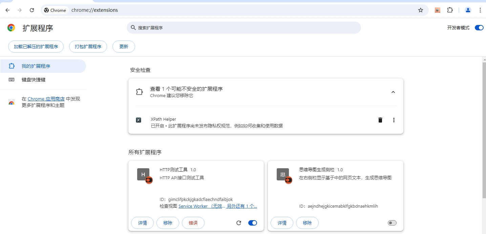

# HTTP测试工具箱

## 功能概述

这是一个功能强大的 Chrome 浏览器扩展工具,主要用于 HTTP 接口测试和开发辅助。

主要功能包括:

- HTTP 请求测试
- 网络请求抓取
- JSON 格式化
- 二维码生成
- Base64 编解码
- URL 编解码
- 时间戳转换
- MD5 加密
- 其他实用工具

## 安装方法

1. 下载源代码并解压
2. 打开 Chrome 浏览器,进入扩展程序页面 (chrome://extensions/)
3. 开启"开发者模式"
4. 点击"加载已解压的扩展程序",选择解压后的文件夹

## 主要功能使用说明

### 1. HTTP 请求测试

#### 基本功能
- 支持 GET、POST、PUT、DELETE 等常用 HTTP 方法
- 可配置请求头、请求体
- 支持代理设置
- 支持请求重定向控制
- 支持 cURL 命令解析

#### 使用方法
1. 点击扩展图标,选择"HTTP测试"
2. 在主界面填写:
   - 请求方法
   - URL
   - 请求头
   - 请求体(如需)
   
   
   

3. 点击"发送"按钮执行请求
4. 在响应区域查看:
   - 响应状态
   - 响应头
   - 响应体
   - Cookie信息
   
   

### 2. 网络请求抓取

#### 功能特点
- 自动记录页面的网络请求
- 支持按方法、URL 筛选
- 可将请求发送到测试工具重放
- 支持清空历史记录

#### 使用方法
1. 打开开发者工具(F12)
2. 切换到"HTTP测试工具"面板
3. 实时查看页面的网络请求
4. 可通过搜索框筛选请求
5. 点击"发送到测试工具"将请求发送到主测试界面

### 3. JSON 格式化

#### 功能特点
- JSON 格式化与压缩
- 支持语法错误提示
- 支持一键复制
- 支持快捷键操作

#### 使用方法
1. 点击扩展图标,选择"JSON格式化"
2. 在左侧输入框粘贴 JSON 文本
3. 使用功能按钮:
   - 格式化: 美化 JSON 格式
   - 压缩: 移除空格和换行
   - 清空: 清除输入输出
   - 复制: 复制格式化结果

### 4. 其他工具

#### Base64 编解码

#### URL 编解码

#### 时间戳转换

#### MD5 加密

## 快捷键

- `Ctrl + Enter`: 格式化 JSON
- `Ctrl + C`: 复制格式化结果(在非输入框状态)
- `Enter`: 触发编码/解码/加密操作(在相应工具的输入框中)

## 注意事项

1. 代理设置仅对当前请求有效
2. 部分功能需要特定的扩展权限
3. 建议在开发环境下使用
4. 请勿在生产环境使用未经验证的请求

## 常见问题

1. Q: 为什么某些请求发送失败?
   A: 可能是由于跨域限制或目标服务器限制导致,建议检查代理设置或添加必要的请求头

2. Q: 为什么抓取的请求不完整?
   A: 需要在请求发生前打开开发者工具面板

3. Q: JSON格式化显示错误?
   A: 请检查输入的JSON格式是否正确,注意括号匹配和逗号使用

## 更新日志

### v1.0
- 初始版本发布
- 实现基础HTTP测试功能
- 添加JSON格式化工具
- 集成常用编解码工具

## 联系方式

如有问题或建议,请通过以下方式联系:
- 在 GitHub 上提交 Issue
- 扫描"关于我"中的二维码关注获取更新

## 许可证

[MIT License](LICENSE) 
